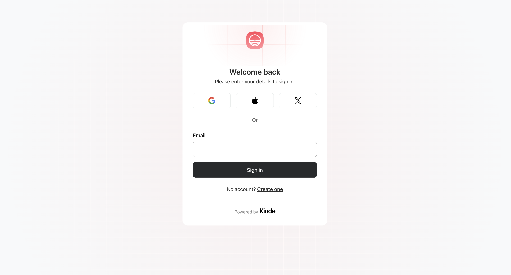

# 🎨 Gridster - Kinde Custom UI Starter Template

A fully customizable UI starter template built with React Server Components and Kinde's Custom UI feature. Design your auth flows with complete control over the UI.

## Preview



## Features

- 🎯 Full control over auth UI design and layout
- 🚀 Built with React Server Components
- 🔒 Kinde Authentication integration
- 📱 Responsive design out of the box

## Prerequisites

- npm or yarn
- A Kinde account with Custom UI feature enabled

## Quick Start

1. Clone the template:

```bash
git clone https://github.com/yourusername/gridster.git
cd gridster
```

2. Install dependencies:

```bash
npm install
# or
yarn install
```

## Customization Guide

### Page Layouts

The template includes customizable layouts for all authentication pages:

- Sign In
- Sign Up
- Password Reset
- Email Verification
- Multi-factor Authentication
- Social Authentication
- Error Pages
- And more...

Each layout can be customized in the `kindeSrc/enviroment/pages/(kinde)` directory.

## Project Structure

```
gridster/
├── kindeSrc/
│   └── environment/
│       └── pages/
│           └── (kinde)/
│                ├── (default)/
│                │    └── page.tsx
│                └── (login)/
│                     └── page.tsx
└── kinde.json

```

## Contributing

We welcome contributions! Please feel free to submit a Pull Request.

1. Fork the project
2. Create your feature branch (`git checkout -b feature/AmazingFeature`)
3. Commit your changes (`git commit -m 'Add some AmazingFeature'`)
4. Push to the branch (`git push origin feature/AmazingFeature`)
5. Open a Pull Request

## License

This project is licensed under the MIT License - see the [LICENSE](LICENSE) file for details.

## Support

Need help? Here are some resources:

- Check out the [video demos](https://www.loom.com/share/folder/4398af02bbde4f498952ab4654a331a3) for implementation examples
- Join the [Kinde Community](https://community.kinde.com)
- Open an issue on GitHub
- Review the [Kinde documentation](https://docs.kinde.com)
